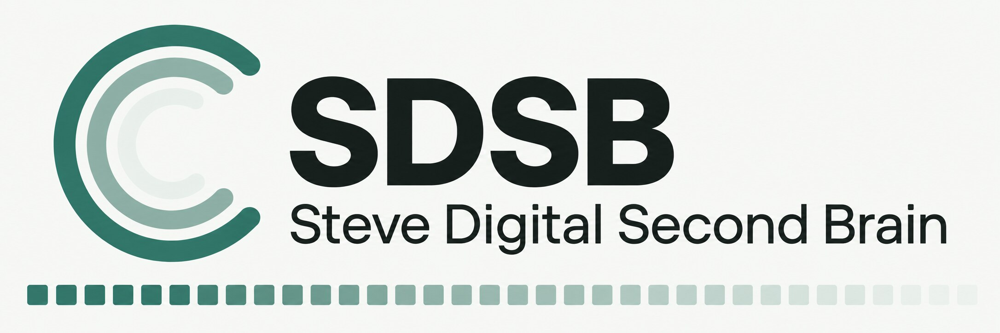
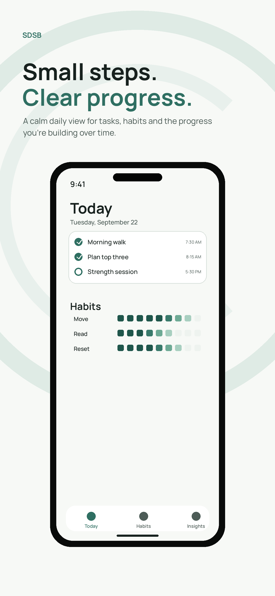
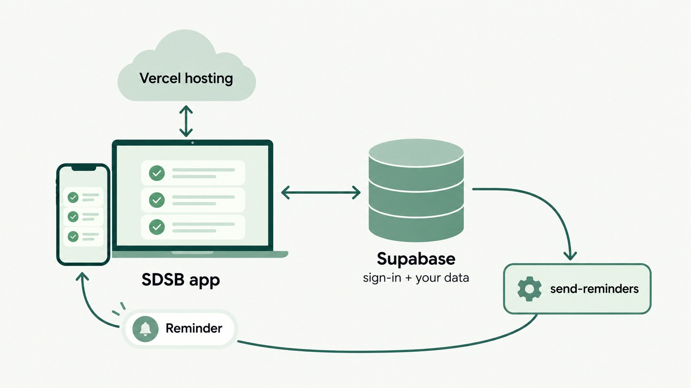
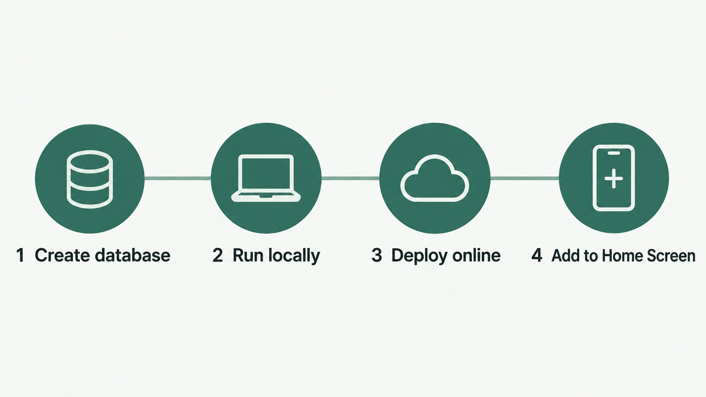

# 🌱 SDSB — Steve Digital Second Brain

Daily tasks, habits and streaks, with a calm dashboard to watch them build up.
A web app you install on your phone like a normal app (PWA), with reminders by push notification.

**Live:** <https://sdsb.vercel.app>

<p align="center">
  
</p>
<p align="center"><sub>Design preview from the brand kit</sub></p>

**Built with:** React + TypeScript + Vite + Tailwind · Supabase (sign-in, data, reminders) · Vercel
(hosting) · Manrope type · the *Growth Rings* brand ([`branding/`](branding/v1/final/README.md)).

---

## 📋 Contents

1. [How it works](#1-how-it-works)
2. [What you need](#2-what-you-need)
3. [Set up the database (Supabase)](#3-set-up-the-database-supabase)
4. [Turn on reminders](#4-turn-on-reminders)
5. [Run the app on your computer](#5-run-the-app-on-your-computer)
6. [Put it online (Vercel)](#6-put-it-online-vercel)
7. [Install SDSB on your phone](#7-install-sdsb-on-your-phone)
8. [Ship a new version](#8-ship-a-new-version)
9. [Tour of the app](#9-tour-of-the-app)
10. [Troubleshooting](#10-troubleshooting)
11. [Repo layout](#11-repo-layout)

---

## 1. How it works



| Piece | Where it runs | What it does |
|---|---|---|
| **App** (`src/`) | Vercel, plus your phone or browser | Today, Habits and Insights screens |
| **Database** (`supabase/migrations/`) | Supabase | Tasks, habits, settings. Every row belongs to the signed-in user (row-level security) |
| **send-reminders** (`supabase/functions/`) | Supabase Edge Function | Sends due-task reminders by Web Push; a database job calls it every minute |

The whole setup at a glance:



> ⚠️ **There is no separate test database.** Running the app on your computer uses the same Supabase
> project as the live site, so anything you change locally changes your real data.

---

## 2. What you need

- A **Supabase** account
- A **Vercel** account, linked to this GitHub repo
- **Node.js 20+** and **npm** (`node -v` to check)
- The **Supabase CLI**: `npm install -g supabase` (or see <https://supabase.com/docs/guides/cli>)

---

## 3. Set up the database (Supabase)

> Already set up? The live project is `sdsb` (ref `rvdqfdrscmziisbnkllo`). Skip to [step 5](#5-run-the-app-on-your-computer).

1. Create a project at <https://supabase.com/dashboard>.
2. Link this repo to it and push the schema:

   ```bash
   git clone https://github.com/Steve-Plancher/sdsb.git
   cd sdsb
   supabase login
   supabase link --project-ref <your-project-ref>
   supabase db push              # applies everything in supabase/migrations/
   ```

3. **Turn off public sign-ups:** **Authentication → Sign In / Providers → Email** → disable *Allow new users to sign up*.
4. **Create your account:** **Authentication → Users → Add user** (email + password).
5. Copy the **Project URL** and **publishable key** from **Project Settings → API**. The app needs them.

---

## 4. Turn on reminders

Reminders use **Web Push**. You need a VAPID key pair, the Edge Function, and a once-a-minute job.

### 4.1 Make the keys

```bash
npx web-push generate-vapid-keys     # prints a Public Key and a Private Key
openssl rand -hex 32                 # a random CRON_SECRET
```

### 4.2 Deploy the function with its secrets

```bash
supabase secrets set \
  VAPID_PUBLIC_KEY=<public key> \
  VAPID_PRIVATE_KEY=<private key> \
  CRON_SECRET=<the random secret>

supabase functions deploy send-reminders     # verify_jwt = false comes from supabase/config.toml
```

### 4.3 Schedule it every minute

In **SQL Editor**, store the same secret in Vault, then create the job:

```sql
create extension if not exists pg_cron;
create extension if not exists pg_net;

select vault.create_secret('<the random secret>', 'sdsb_cron_secret');

select cron.schedule('sdsb-reminders', '* * * * *', $$
  select net.http_post(
    url := 'https://<your-project-ref>.supabase.co/functions/v1/send-reminders',
    headers := jsonb_build_object(
      'Content-Type', 'application/json',
      'x-cron-secret', (select decrypted_secret from vault.decrypted_secrets where name = 'sdsb_cron_secret')
    ),
    body := '{}'::jsonb,
    timeout_milliseconds := 30000
  );
$$);
```

Check it's running: `select jobname, schedule, active from cron.job;`

---

## 5. Run the app on your computer

```bash
npm install
cp .env.example .env.local
```

Edit `.env.local`:

```bash
VITE_SUPABASE_URL=https://<project-ref>.supabase.co
VITE_SUPABASE_PUBLISHABLE_KEY=sb_publishable_...
VITE_VAPID_PUBLIC_KEY=<the VAPID public key from 4.1>
```

Start it:

```bash
npm run dev          # → http://localhost:5173
```

| Command | What it does |
|---|---|
| `npm run build` | Type-checks and builds into `dist/` |
| `npm run preview` | Serves the built `dist/` locally |
| `npm run lint` | Lints with oxlint |
| `npm run test:recurrence` | Checks the repeating-task date rules |
| `npm run release` | Ships a new version (see [step 8](#8-ship-a-new-version)) |

---

## 6. Put it online (Vercel)

1. In Vercel: **Add New → Project → Import** `Steve-Plancher/sdsb` (Vite is detected automatically).
2. Add the three `VITE_…` variables from `.env.local` under **Environment Variables**.
3. Click **Deploy**.

After that, **every push to `main` redeploys automatically.**

---

## 7. Install SDSB on your phone

- **iPhone (Safari):** open <https://sdsb.vercel.app> → **Share** → **Add to Home Screen**.
- **Android (Chrome):** open the site → **⋮** → **Install app**.

Then open SDSB from the home screen, go to **Settings → Notifications**, and allow
notifications. On iPhone, notifications only work in the Home Screen version, not in a Safari tab.

---

## 8. Ship a new version

```bash
npm run release            # 1.0.0 → 1.0.1   a fix or small change
npm run release minor      # 1.0.1 → 1.1.0   a new feature
npm run release major      # 1.1.0 → 2.0.0   a big rework
```

This bumps the version, tags it, pushes, and publishes a GitHub release listing the changes.
Vercel deploys from the push, and the new number shows at the bottom of **Settings**.
It refuses to run if you have uncommitted changes or aren't in sync with GitHub.

---

## 9. Tour of the app

| Tab | Shows |
|---|---|
| **Today** | Progress ring, today's tasks (tap one to edit title, due date and time, priority, repeat and a note), today's habit checks |
| **Habits** | 7-day rows per habit; tap a habit for its streak, stats and a tickable month calendar |
| **Insights** | Week / Month / Year trends, consistency heatmap, highlights |
| **Settings** | Appearance, reminders ("Remind me about tasks"), completed-task history, Add to Home Screen, account |

Phones get a bottom tab bar; wider screens get the tabs in the header.

---

## 10. Troubleshooting

| Problem | Fix |
|---|---|
| Can't sign in / "sign-ups disabled" | Create the user in Supabase **Authentication → Users** (step 3.4) |
| No reminders arrive | Check `select * from cron.job;`, then **Edge Functions → send-reminders → Logs**. A `403` means `CRON_SECRET` and the Vault secret don't match |
| iPhone never asks for notification permission | Open SDSB from the **Home Screen** icon, not Safari |
| `.env.local` changes ignored | Stop `npm run dev` (Ctrl+C) and start it again |
| Phone shows an old version | Fully close the app and reopen it |

---

## 11. Repo layout

```
sdsb/
├── src/
│   ├── views/              # today, habits, habit-detail, insights, history, settings, task-detail
│   ├── components/         # auth, brand, dashboard (heatmap, task list, trend chart), layout, ui
│   ├── hooks/              # auth, data (use-brain), settings, theme
│   └── lib/                # Supabase client, push, recurrence, dates, router
├── public/                 # icons, fonts, manifest, service worker (sw.js)
├── supabase/
│   ├── migrations/         # database schema + security rules (source of truth)
│   └── functions/send-reminders/   # Web Push reminder function
├── scripts/                # release.sh, recurrence checks
├── branding/v1/final/      # Growth Rings brand kit: logos, icons, guide, launch art
└── docs/images/            # README images
```

Notes for AI coding assistants: [`CLAUDE.md`](CLAUDE.md).
